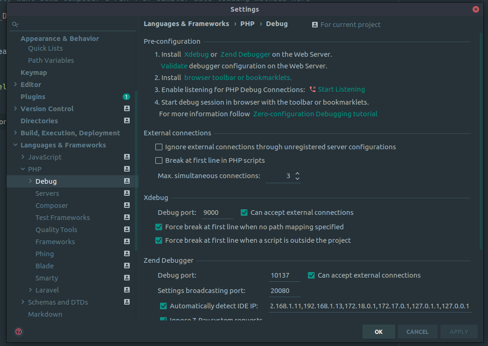
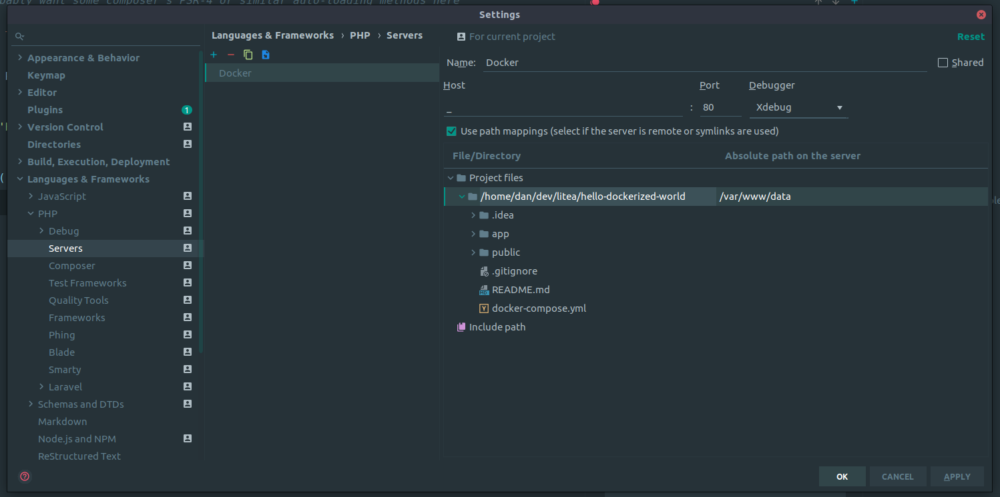
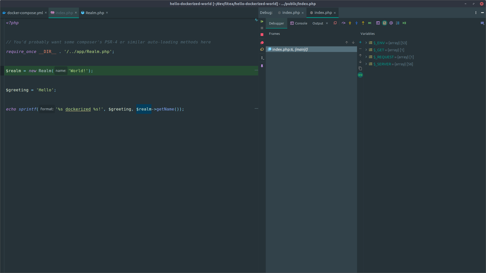
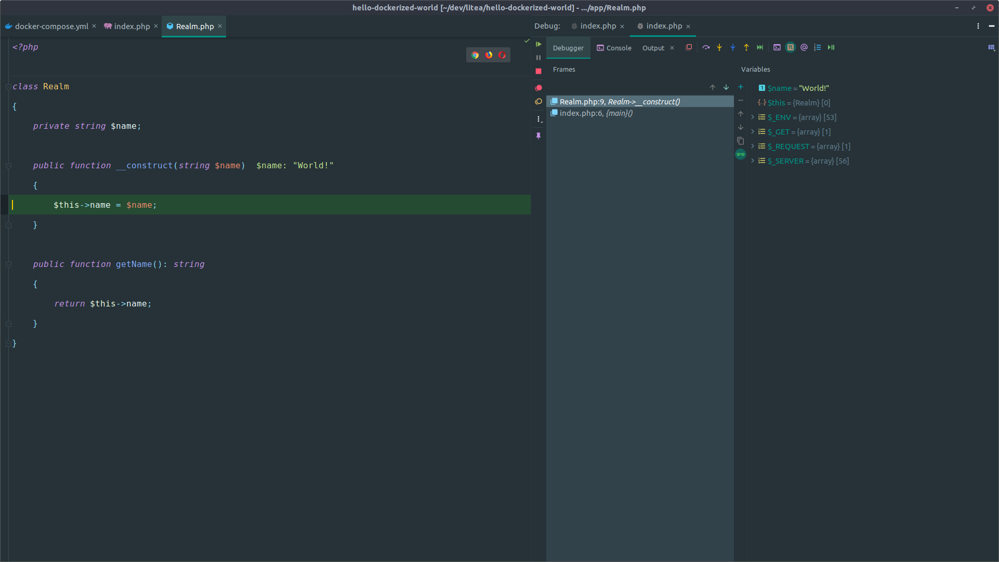
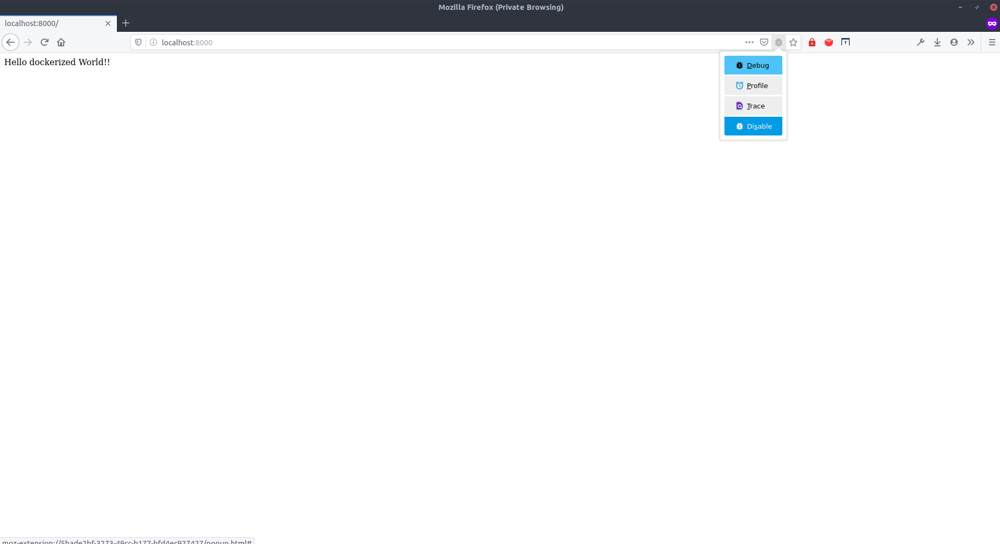
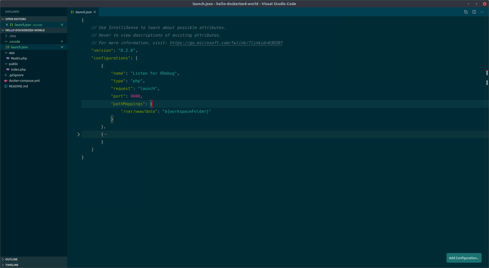
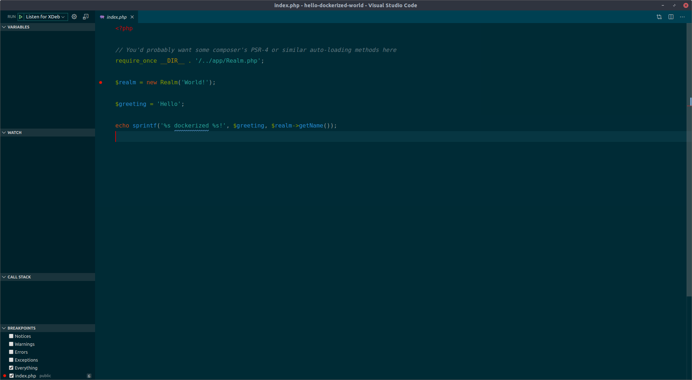
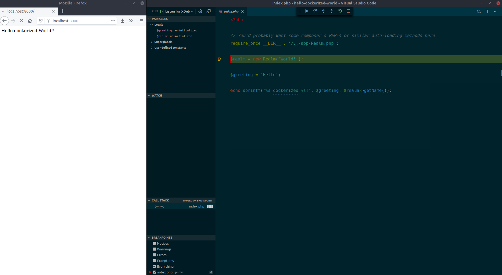
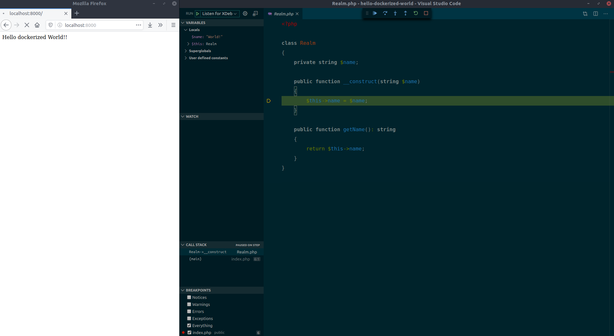

# PHP 7.4 FPM

## Table of contents

- [What is FPM?](#what-is-fpm)
- [Basic usage](#basic-usage)
- [Not so basic usage](#not-so-basic-usage)
- [Debugging using XDebug](#debugging-using-xdebug)
- [Available environment variables and build arguments](#available-environment-variables-and-build-arguments)

## What is FPM?

TODO: Little bit of theory and references regarding FPM will be here. 

## Basic usage

TODO

## Not so basic usage

TODO:
Dockerized laravel
Usage with gitlab ci

## Debugging using XDebug

When dealing with larger code base, the simple `echo $myVar` as a debugging tool
is not the best one to reach for. It pretty much never is, but for many developers (myself included)
it's been THE debugging tool for long part of their programming carriers.

Taken from the [official site](https://xdebug.org/):

> Xdebug is an extension for PHP to assist with debugging and development.

It does not say much, but when you learn to embrace the powerful tools it provides you with
you won't ever (maybe) return to the `echo $myVar` approach mentioned early.

Dockerizing your application, fortunately, does not take this tool away and we'll
take a closer look on how to set up xdebug with our PHP image and popular editors.

The setup is different depending on the IDE or editor you are using. Let's see how this is done
for [PHPStorm](https://www.jetbrains.com/phpstorm/) and [VSCode](https://code.visualstudio.com/).

I'll be using our example [hello dockerized world](https://github.com/liteacz/hello-dockerized-world)
repository, so if you feel like so, grab it and work along to get rid of the `echo $myVar` debugging
"technique".

### Project structure

1. Pull the repository and enter the directory

        $ git pull git@github.com:liteacz/hello-dockerized-world.git
        $ cd hello-dockerized-world

2. Spin up the containers

        $ docker-compose up -d

3. Open the link http://localhost:8000 in your favorite web browser.

4. Verify the directory contents is similar to this:

        $ tree .
        .
        ├── app
        │   └── Realm.php
        ├── docker-compose.yml
        ├── public
        │   └── index.php
        └── README.md

### XDebug with PHPStorm

1. Go to `Settings > Languages & Frameworks > PHP > Debug` and enable PHPStorm to listen for incoming connections by clicking the "Start Listening".

    Make sure the `Debug port` is set to the same value as your `$XDEBUG_PORT` environment variable.
    If you did not specify any, it defaults to `9000`.

    

2. Then go to `... > PHP > Servers` and configure the path mapping to point to `/var/www/data`.
That is the directory inside the container that holds the application code.

    

3. Setup some break points. You can do that by clicking the left side of the line in the editor
or by using the shortcut. I suggest you to learn the shortcuts which will make you faster and more efficient.
The default PHPStorm key combination for toggling the breakpoint is `CTRL + F8`. So go ahead and put it somewhere.

    

4. And the final step is to start the debugging session. You do that by visiting the page URL.
http://localhost:8000.

    If you open the page, nothing actually happens. That's because we've disabled the
    xdebug auto-start feature by not specifying the `$XDEBUG_AUTOSTART` environment variable
    to `1`.

    And that's what you'd want most of the time. We want to start the debugging when we want it to.
    Reaching out for the xdebug documentation, you'll find out, that there [three ways to do that](https://xdebug.org/docs/remote).

    For our purposes the easiest way to start the debugging is to specify a `XDEBUG_SESSION_START` GET.
    So go to the http://localhost:8000/?XDEBUG_SESSION_START and the debugging process should be initialized
    resulting into something like this:

    

5. Do the debugging. On the left-hand side of the screen, there is the code itself and on the
right-hand side, there is the window with debugging information. Now it's up to you to travel
through the code by pressing `F7`, `F8` and `F9`. Read more about the shortcuts in [PHPStorm documentation](https://www.jetbrains.com/help/phpstorm/debugging-code.html#useful-debugger-shortcuts)

    For brief introduction:

    `F7` is for `Step into` function. Steps inside the current function or method.
    Useful to inspect the internal details of called function/method. E.g. in the screenshot above
    the `F7` moves you inside the `Realm`'s class constructor as it's the method being called on that line.
    See the image below.

    

    If there is no method or function on the current line, PHPStorm simply moves to the next instruction.

    `F8` is for `Step over`. From the PHPStorm's documentation:

    > Steps over the current line of code and takes you to the next line even if the highlighted line has method calls in it. The implementation of the methods is skipped, and you move straight to the next line of the caller method.
    With these, now you can step through your program and examine method calls, return values and
    variables defined to better understand the execution flow of the application itself and potentially
    to track down the source of the error.

6. Note on the `XDEBUG_SESSION_START` parameter.

    This parameter instructs the xdebug engine to initialize the debugging process.
    The thing is it set's a browser cookie that indicates so. After that, even if you remove
    the GET parameter, xdebug will start the debugging anyways. From then it behaves like if you set
    the `$XDEBUG_AUTOSTART` env variable.

    To better control the debugging there are browser extensions that can set these cookies
    for you and when needed, remove them. Checkout the ones relevant to you:

    - [Firefox extension](https://addons.mozilla.org/en-GB/firefox/addon/xdebug-helper-for-firefox/)
    - [Chrome extension](https://chrome.google.com/webstore/detail/xdebug-helper/eadndfjplgieldjbigjakmdgkmoaaaoc)
    - [Safari extension](https://github.com/benmatselby/xdebug-toggler)

    You can than enable/disable the debugging by clicking the button:

    

### XDebug with VSCode

With VSCode the setup is similar and also straight forward.

0. Install the [php-debug](https://github.com/felixfbecker/vscode-php-debug) extension.

1. Open launch configurations file. `Run > Open Configurations` and add the configuration.

    

2. Add breakpoints

    
    
3. Start debugging (`Run > Start Debugging`).

    This is equivalent to PHPStorm's _Start listening for connections_.
    
4. Go to http://localhost:8000?XDEBUG_SESSION_START or use relevant browser extension.
See "Note on the `XDEBUG_SESSION_START` parameter" in PHPStorm configuration.

    
    
    

From there you can navigate through the code using `Step into`, `Step over` and `Continue`
actions similarly like in PHPStorm. Make sure to get familiarize with the keyboard shortcuts associated
with the given actions to be even faster and more productive.

## Available environment variables and build arguments

### Base image

| Variable name            | Default Value        | Type      | Description    |
| ---------------------    | ----------------     | --------- | -------------- |
| `$FPM_ROOT_DIR`          | public               | Env       | Sets fpm root directory |
| `$UID`                   | n/a                  | Env       | The www-data user will be recreated with given UID. Useful for local development so both host user (you) and www-data have same UID (resolves permission issues on shared volumes). |
| `$CHOWN_DATA`            | n/a                  | Env       | When set, `/var/www/data` directory will be `chown`ed to www-data user |

### Build image

All variables from [Base image](#base-image) and:

| Variable name                         | Default Value        | Type            | Description    |
| ------------------------------------- | ----------------     | --------------- | -------------- |
| `$PRIVATE_REPOSITORY_SSH_KEY`         | n/a                  | Runtime/Build   | SSH key to use to connect to the private repository server |
| `$PRIVATE_REPOSITORY_SERVER_URL`      | n/a                  | Runtime/Build   | URL of the private repository server |
| `$PRIVATE_REPOSITORY_SERVER_PORT`     | 22                   | Runtime/Build   | SSH port on the private repository server |

### Dev image

All variables from [Base image](#base-image), [Build image](#build-image) and:

| Variable name               | Default Value        | Type            | Description    |
| --------------------------  | ----------------     | --------------- | -------------- |
| `$RUN_COMPOSER`             | 0                    | Runtime         | When set to 1, composer packages will be installed when container starts |
| `$XDEBUG_EXENSION_PATH`     | xdebug.so            | Runtime         | Sets zend_extension config value |
| `$XDEBUG_ENABLE`            | 1                    | Runtime         | Sets xdebug.remote_enable config value |
| `$XDEBUG_AUTOSTART`         | 0                    | Runtime         | Sets xdebug.remote_autostart config value |
| `$XDEBUG_PORT`              | 9000                 | Runtime         | Sets xdebug.port config value |
| `$XDEBUG_IDEKEY`            | docker               | Runtime         | Sets xdebug.idekey config value         |
| `$XDEBUG_HANDLER`           | dbgp                 | Runtime         | Sets xdebug.remote_handler config value |
| `$XDEBUG_CONNECT_BACK`      | 0                    | Runtime         | Sets xdebug.connect_back config value |
| `$XDEBUG_HOST`              | Guessed ip address   | Runtime         | Sets xdebug.host config value |
